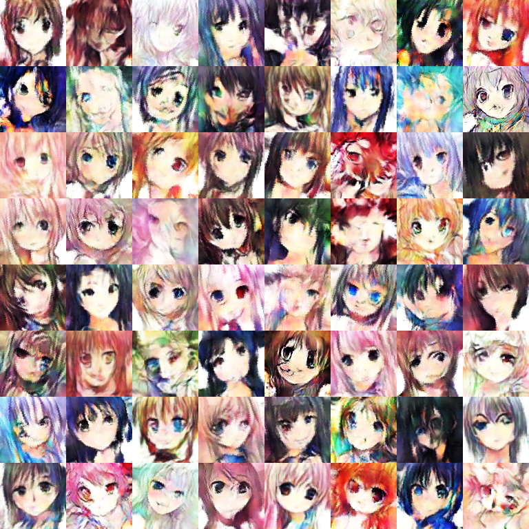

# ANIME Generative Adversarial Network

### Using [ANIMEface](https://onedrive.live.com/?authkey=%21AMWv6YL4Nh9ZqEk&cid=F800716878CC5800&id=F800716878CC5800%21463&parId=root&action=locate) dataset and runnung it through a GANS model made with KERAS.

